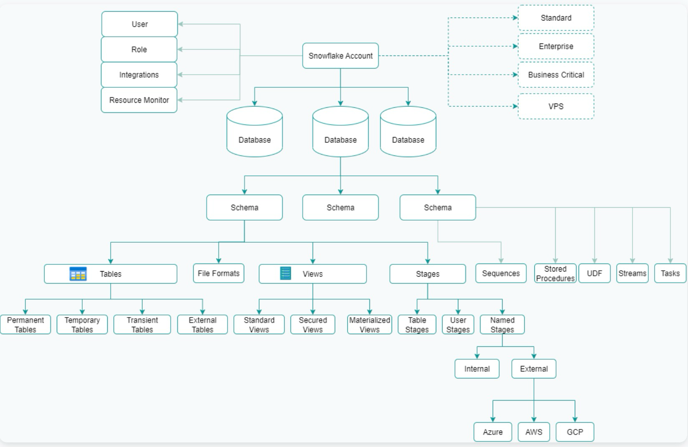
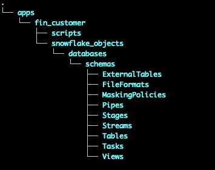

# Snowflake Demo
# 


Description of repo here

## Table of Contents

- [Security](#security)
- [Background](#background)
- [Install](#install)
- [Usage](#usage)
- [API](#api)
- [Contributing](#contributing)
- [Tree](#Directory-Structure-of-repo)

## Snowflake Object Hierarchy


## Proposed GP application directory structure

The repository directory structure proposed here corresponds with the way in which Snowflake organizes these objects.  

Note: There are SF objects that don't require the context of a database.schema to create like External Storage Integrations (think pointers to s3 locations). However, from the standpoint of the Principle of Least Privilege we tend to manage these Snowflake objects at the schema level anyway. Why? Because we would never create an External Storage integration that points to an entire Georgia Pacific s3 bucket -right? We would instead create a SI that points to a data set -which corresponds to schema any way you look at it.

Some of these items like Masking Policies might very well be best stored in the ADM_CONTROL_DB with limited privileges.

```
mkdir -p ./apps/adm_control/{snowflake_objects/databases/schemas/tags_schema/{externalTables,fileFormats,maskingPolicies,pipes,stages,streams,tables,tasks,views,sequences,storedProcedures,udfs,streams,tasks},scripts};

mkdir -p ./apps/adm_control/{snowflake_objects/databases/schemas/alerts_schema/{externalTables,fileFormats,maskingPolicies,pipes,stages,streams,tables,tasks,views,sequences,storedProcedures,udfs,streams,tasks},scripts};

-- "ENTER YOUR APPLICATION HERE" will be a 3 char "business segment", an underscore, then application name.  
-- For instance a "segment" called ADM and an "application" called "CONTROL" might have two schemas, "ALERTS" AND "TAGS" would have these as mkdir commands:  

mkdir -p ./apps/adm_control/{snowflake_objects/databases/adm_control_db/schemas/alerts/{externalTables,fileFormats,maskingPolicies,pipes,stages,streams,tables,tasks,views,sequences,storedProcedures,udfs,streams,tasks},scripts};

mkdir -p ./apps/adm_control/{snowflake_objects/databases/adm_control_db/schemas/tags/{externalTables,fileFormats,maskingPolicies,pipes,stages,streams,tables,tasks,views,sequences,storedProcedures,udfs,streams,tasks},scripts};
```


### Any optional sections


## Functional Role Descriptions
- This isn't real. I got the data from Gitlab docs and found the table formatter online. Roles and Descriptions might be worth comparing to our Functional Roles. But the formatter from table data in Excel is worth using!!
- https://handbook.gitlab.com/handbook/enterprise-data/platform/#warehouse-access
- https://tabletomarkdown.com/convert-spreadsheet-to-markdown/


| Functional Role         | Description                                                                                                                | SAFE Data Y/N |
| ----------------------- | -------------------------------------------------------------------------------------------------------------------------- | ------------- |
| data_team_analyst       | Access to all PROD data, sensitive marketing data, Data Platform metadata and some sources.                                | Yes           |
| analyst_core            | Access to all PROD data and meta data in the Data Platform                                                                 | No            |
| analyst_engineering     | Access to all PROD data, meta data in the Data Platform and Engineering related data sources.                              | Yes           |
| analyst_growth          | Access to all PROD data, meta data in the Data Platform and various data sources.                                          | Yes           |
| analyst_finance         | Access to all PROD data, meta data in the Data Platform and finance related data sources.                                  | Yes           |
| analyst_marketing       | Access to all PROD data, meta data in the Data Platform and marketing related data sources.                                | Yes           |
| analyst_people          | Access to all PROD data, meta data in the Data Platform and various related data sources, including sensitive people data. | Yes           |
| analyst_sales           | Access to all PROD data, meta data in the Data Platform and various related data sources                                   | Yes           |
| analyst_support         | Access to PROD data, meta data in the Data Platform and raw / prep Zendesk data, including sensitive Zendesk data          | No            |
| analytics_engineer_core | A combination of analyst_core, data_team_analyst role with some additions                                                  | Yes           |
| data_manager            | Extension access to Snowflake data                                                                                         | Yes           |
| engineer                | Extension access to Snowflake data to perform data operation tasks in Snowflake                                            | Yes           |
| snowflake_analyst       | Access to PROD data in Snowflake, EDM schema and workspaces                                                                | No            |
| snowflake_analyst_safe  | Access to PROD data in Snowflake, EDM schema and workspaces including SAFE data                                            | Yes           |
### Any optional sections

## Install

This module depends upon a knowledge of [Markdown]().

```
```

### Any optional sections

## Usage

```
```

Note: The `license` badge image link at the top of this file should be updated with the correct `:user` and `:repo`.

### Any optional sections

## API

### Any optional sections

## More optional sections

## Contributing

See [the contributing file](CONTRIBUTING.md)!

PRs accepted.

Small note: If editing the Readme, please conform to the [standard-readme](https://github.com/RichardLitt/standard-readme) specification.

### Useful Commands (temp)
git remote get-url origin

SHOW GIT REPOSITORIES;
DESCRIBE GIT REPOSITORY SNOWFLAKE_GIT_REPO;
ALTER GIT REPOSITORY SNOWFLAKE_GIT_REPO FETCH;


## Directory Structure of repo

[MIT © Richard McRichface.](../LICENSE)