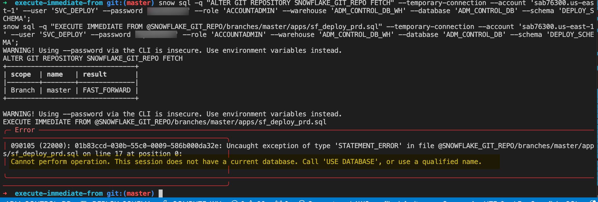

# Approaches to using EXECUTE IMMEDIATE and errors

The desire is to use Github Actions together with "EXECUTE IMMEDIATE FROM" to orchestrate our deployments.  Here's the desired flow:

1) A commit to a branch (dev/qa/prd) [triggers main.yml](/.github/workflows/main.txt)  which fires sf_deploy_prd.sql (my driver script).
2) sf_deploy_prd.sql will contain ALL updates we wish to perform, each also using "EXECUTE IMMEDIATE FROM".
3) Commits to Dev writes to our Dev account, qa to our qa account, etc .

I'm having no issues building across multiple accounts. The issue is with my nested "EXECUTE IMMEDIATE FROM" calls. 

I've tried various approaches:

## Approach #1 - Using Github Actions:  

1) Using Github Actions [with main.yml](/.github/workflows/main.txt) fires [sf_deploy_prd.sql](apps/sf_deploy_prd.sql) using EXECUTE IMMEDIATE FROM".   
2) sf_deploy_prd.sql contains two statements (below).  
[tags.sql](apps/adm_control/snowflake_objects/databases/schemas/tags_schema/tags.sql) 

apps/adm_control/snowflake_objects/databases/schemas/alerts_schema/alerts.sql
[
    
](apps/adm_control/snowflake_objects/databases/schemas/tags_schema/tags.sql)

alerts.sql  
```
First line succeeds >> EXECUTE IMMEDIATE FROM @SNOWFLAKE_GIT_REPO/branches/master/apps/adm_control/snowflake_objects/databases/schemas/tags_schema/tags.sql;
Second line fails >> EXECUTE IMMEDIATE FROM @SNOWFLAKE_GIT_REPO/branches/master/apps/adm_control/snowflake_objects/databases/schemas/alerts_schema/alerts.sql; 
```
Exception on second line:  
```
Uncaught exception of type 'STATEMENT_ERROR' in file @SNOWFLAKE_GIT_REPO/branches/master/apps/sf_deploy_prd.sql on line 20 at position 0:           │
 │ Cannot perform operation. This session does not have a current database. Call 'USE DATABASE', or use a qualified name.    
```

## Approach 2 - From the command line:  



\****************************************************************************************/


## Snowflake Object Hierarchy


